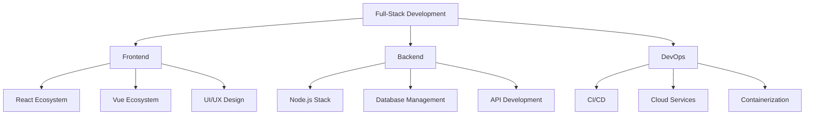

<div align="center">
    
</div>

<div align="center">
    <a href="https://git.io/typing-svg">
        
    </a>
</div>

<div align="center">
    <a href="https://github.com/decemberlnwza007?tab=followers">
        
    </a>
    <a href="https://github.com/decemberlnwza007?tab=repositories&sort=stargazers">
        
    </a>
    
</div>

<div align="center">
    <br>
    
</div>

<h2 align="center">🌟 About Me</h2>

<div align="center">
    
</div>

```javascript
const developer = {
    name: "Phongsakorn 'Thanwa' Thongrak",
    title: "Full-Stack Developer & IT Innovator",
    location: "🌏 Samut Sakhon, Thailand",
    workingOn: ["Web Apps", "Mobile Apps", "AI Projects"],
    skills: {
        languages: ["JavaScript", "TypeScript", "Python", "PHP"],
        frontend: ["React", "Next.js", "Vue", "Nuxt"],
        backend: ["Node.js", "Express", "NestJS", "Laravel"],
        databases: ["MongoDB", "PostgreSQL", "Redis"],
        design: ["Figma", "Adobe XD", "Photoshop"]
    },
    funFact: "I turn ☕ into </code>",
    motto: "Code with purpose, design with passion! 🚀"
};
```

<div align="center">
    
</div>

<details>
<summary><b>🎯 Skills & Technologies</b></summary>
<br>

<div align="center">
    <h3>🌈 Frontend Mastery</h3>
    
    
    <h3>⚡ Backend Expertise</h3>
    
    
    <h3>🛠️ Tools & DevOps</h3>
    
</div>


</details>

<details>
<summary><b>📊 GitHub Stats</b></summary>
<br>

<div align="center">
    


</div>
</details>

<h2 align="center">🤝 Let's Connect</h2>

<div align="center">
    <a href="https://linkedin.com/in/decemberlnwza007" target="_blank">
        
    </a>&nbsp;
    <a href="https://twitter.com/decemberlnwza007" target="_blank">
        
    </a>&nbsp;
    <a href="mailto:phongsakorn@example.com">
        
    </a>&nbsp;
    <a href="https://instagram.com/decemberlnwza007" target="_blank">
        
    </a>
</div>

<br>

<div align="center">
    
</div>

<div align="center">
    
</div>
