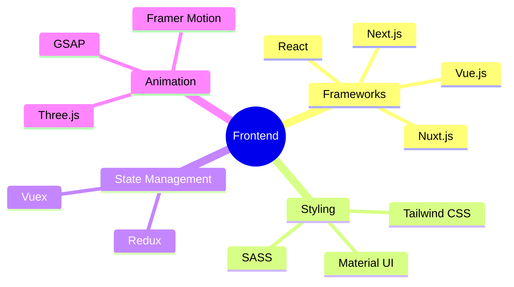
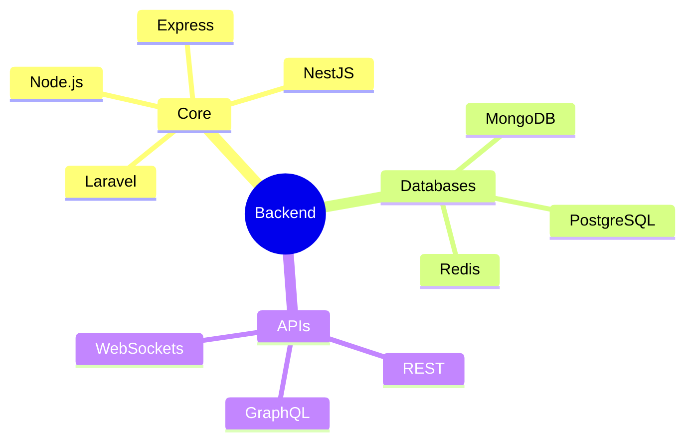

<div align="center">
    
</div>

<div align="center">
    <a href="https://git.io/typing-svg">
        
    </a>
</div>

<div align="center">
    
    
    
</div>

<br>
---

### 🌟 About Me `const developer = {`

```typescript
{
    name: "Phongsakorn Thongrak",
    nickname: "Thanwa",
    location: "🌏 Samut Sakhon, Thailand",
    title: "Full-Stack Developer & IT Student",
    interests: [
        "Building scalable web applications",
        "Creating intuitive user interfaces",
        "Exploring AI/ML technologies",
        "IoT innovations"
    ],
    motto: "Transforming ideas into digital reality ✨",
    currentlyLearning: [
        "Web3 Development",
        "Cloud Architecture",
        "Advanced AI/ML"
    ]
}
```

### 🎯 Expertise & Skills

<details>
<summary>🌈 Frontend Development</summary>
<br>


</details>

<details>
<summary>⚡ Backend Engineering</summary>
<br>


</details>

<details>
<summary>🛠️ DevOps & Tools</summary>
<br>

<div align="center">
    <table>
        <tr>
            <td align="center" width="96">
                
                <br>Docker
            </td>
            <td align="center" width="96">
                
                <br>Kubernetes
            </td>
            <td align="center" width="96">
                
                <br>AWS
            </td>
            <td align="center" width="96">
                
                <br>GitHub
            </td>
            <td align="center" width="96">
                
                <br>Nginx
            </td>
        </tr>
    </table>
</div>
</details>

### 📊 GitHub Analytics

<div align="center">
    
</div>

<br>

<div align="center">
    
    
</div>

### 🌐 Connect with Me

<div align="center">
    <a href="https://linkedin.com/in/decemberlnwza007">
        
    </a>
    <a href="https://twitter.com/decemberlnwza007">
        
    </a>
    <a href="mailto:phongsakorn@example.com">
        
    </a>
    <a href="https://instagram.com/decemberlnwza007">
        
    </a>
</div>

<br>

<div align="center">
    
</div>

<div align="center">
    
</div>
