```mermaid
graph TD
    A[Frontend Ecosystem] --> B[Core Technologies]
    A --> C[Frameworks]
    A --> D[Styling Solutions]
    A --> E[State Management]
    
    B --> B1[HTML5]
    B --> B2[CSS3]
    B --> B3[TypeScript]
    
    C --> C1[React & Next.js]
    C --> C2[Vue & Nuxt.js]
    C --> C3[Angular]
    
    D --> D1[Tailwind CSS]
    D --> D2[Styled Components]
    D --> D3[Material UI]
    
    E --> E1[Redux Toolkit]
    E --> E2[Zustand]
    E --> E3[Pinia]
    
    style A fill:#00E5FF,stroke:#fff,stroke-width:2px
    style B,C,D,E fill:#1a1b27,stroke:#00E5FF,stroke-width:2px
```

```mermaid
graph TD
    A[Backend Systems] --> B[Core Services]
    A --> C[Data Layer]
    A --> D[API Design]
    A --> E[Security]
    
    B --> B1[Node.js]
    B --> B2[NestJS]
    B --> B3[Laravel]
    
    C --> C1[PostgreSQL]
    C --> C2[MongoDB]
    C --> C3[Redis]
    
    D --> D1[REST]
    D --> D2[GraphQL]
    D --> D3[gRPC]
    
    E --> E1[JWT]
    E --> E2[OAuth2]
    E --> E3[Rate Limiting]
    
    style A fill:#FF6B6B,stroke:#fff,stroke-width:2px
    style B,C,D,E fill:#1a1b27,stroke:#FF6B6B,stroke-width:2px
```

<div align="center">
    
</div>

<div align="center">
    <a href="https://git.io/typing-svg">
        
    </a>
</div>

<div align="center">
    <a href="https://github.com/decemberlnwza007?tab=followers">
        
    </a>
    <a href="https://github.com/decemberlnwza007?tab=repositories&sort=stargazers">
        
    </a>
    
</div>

<br>

## 🌟 About Me

```typescript
interface Developer {
    readonly name: string;
    readonly role: string;
    readonly location: string;
    readonly languages: string[];
    readonly specializations: string[];
    readonly interests: string[];
    readonly currentFocus: string[];
    
    code(): string;
    solveProblems(): boolean;
    innovate(): Promise<void>;
}

const thanwa: Developer = {
    name: "Phongsakorn Thongrak (Thanwa)",
    role: "Full-Stack Developer & IT Innovation Student",
    location: "🌏 Samut Sakhon, Thailand",
    languages: ["TypeScript", "Python", "Go", "PHP", "Kotlin"],
    specializations: [
        "Web Application Architecture",
        "Cloud-Native Development",
        "UI/UX Engineering",
        "DevOps & Infrastructure"
    ],
    interests: [
        "Emerging Technologies",
        "System Design",
        "Digital Innovation",
        "AI/ML Integration"
    ],
    currentFocus: [
        "Web3 & Blockchain",
        "Microservices Architecture",
        "Edge Computing",
        "AI-Powered Solutions"
    ],
    
    code: () => "Building the future, one commit at a time 💻",
    solveProblems: () => true,
    innovate: async () => {
        while (true) {
            await learn();
            await build();
            await improve();
        }
    }
};
```

## 🛠️ Tech Arsenal

<details>
<summary><b>🎨 Frontend Mastery</b></summary>
<br>

<div align="center">



</div>
</details>

<details>
<summary><b>⚡ Backend Architecture</b></summary>
<br>

<div align="center">



</div>
</details>

<details>
<summary><b>☁️ DevOps & Cloud</b></summary>
<br>

<div align="center">
    <table>
        <tr>
            <td align="center" width="96">
                
                <br>Docker
            </td>
            <td align="center" width="96">
                
                <br>Kubernetes
            </td>
            <td align="center" width="96">
                
                <br>AWS
            </td>
            <td align="center" width="96">
                
                <br>GitHub
            </td>
            <td align="center" width="96">
                
                <br>Nginx
            </td>
            <td align="center" width="96">
                
                <br>GraphQL
            </td>
        </tr>
    </table>
</div>
</details>

## 📊 Performance Metrics

<div align="center">
    
</div>

<br>

<div align="center">
    
    
</div>

<br>

<div align="center">
    <img src="https://githu
