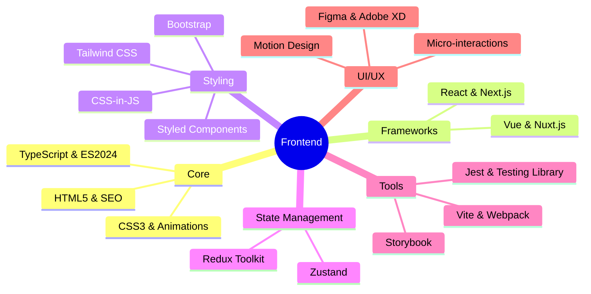
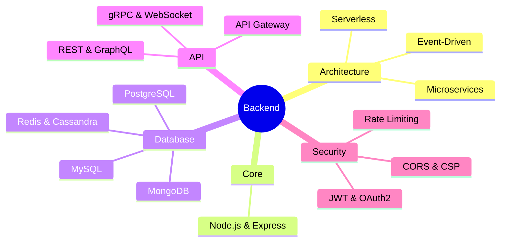

<div align="center">
    
</div>

<div align="center">
    <a href="https://github.com/decemberlnwza007?tab=followers">
        
    </a>
    <a href="https://github.com/decemberlnwza007?tab=repositories&sort=stargazers">
        
    </a>
    
</div>

<br>

<br>

## 🎯 About Me

```python
import asyncio
import logging
from typing import List, Dict

logging.basicConfig(level=logging.INFO, format="%(asctime)s - %(levelname)s - %(message)s")

class TechStack:
    def __init__(self):
        self.frontend: List[str] = ["React", "Next.js", "Vue", "Nuxt", "TypeScript"]
        self.backend: List[str] = ["Node.js", "NestJS", "Go", "Laravel", "Python"]
        self.database: List[str] = ["PostgreSQL", "MongoDB", "Redis", "Elasticsearch"]
        self.devops: List[str] = ["Docker", "Kubernetes", "Jenkins", "GitLab CI"]
        self.cloud: List[str] = ["AWS", "GCP", "Azure", "Digital Ocean"]
        self.ai_ml: List[str] = ["TensorFlow", "PyTorch", "Scikit-learn", "OpenAI"]

    def get_stack(self) -> Dict[str, List[str]]:
        return self.__dict__

class SoftwareArchitect:
    def __init__(self):
        self.name: str = "Phongsakorn Thongrak (Thanwa)"
        self.title: str = "Full-Stack Developer & Digital Innovation Specialist"
        self.location: str = "\U0001F30F Samut Sakhon, Thailand"
        self.tech_stack: TechStack = TechStack()
        self.passions: List[str] = [
            "Building Scalable Solutions",
            "Cloud-Native Architecture",
            "AI/ML Integration",
            "Innovation & Research"
        ]

    async def learn(self):
        logging.info(f"{self.name} is learning new technologies...")
        await asyncio.sleep(2)

    async def build(self):
        logging.info(f"{self.name} is building innovative solutions...")
        await asyncio.sleep(2)

    async def share(self):
        logging.info(f"{self.name} is sharing knowledge with the community...")
        await asyncio.sleep(2)

    async def improve(self):
        logging.info(f"{self.name} is continuously improving...")
        await asyncio.sleep(2)

    async def innovate(self):
        while True:
            await self.learn()
            await self.build()
            await self.share()
            await self.improve()

if __name__ == "__main__":
    thanwa = SoftwareArchitect()
    try:
        asyncio.run(thanwa.innovate())
    except KeyboardInterrupt:
        logging.info("Innovation process stopped by user.")

```

## 💫 Skills & Technologies

<details open>
<summary><b>🎨 Frontend Universe</b></summary>
<br>

<div align="center">



</div>
</details>

<details>
<summary><b>⚡ Backend Ecosystem</b></summary>
<br>

<div align="center">



</div>
</details>

<details>
<summary><b>☁️ DevOps & Cloud Engineering</b></summary>
<br>

<div align="center">
    <table>
        <tr>
            <td align="center" width="100">
                
                <br><strong>Docker</strong>
            </td>
            <td align="center" width="100">
                
                <br><strong>K8s</strong>
            </td>
            <td align="center" width="100">
                
                <br><strong>AWS</strong>
            </td>
            <td align="center" width="100">
                
                <br><strong>GitHub</strong>
            </td>
            <td align="center" width="100">
                
                <br><strong>Nginx</strong>
            </td>
            <td align="center" width="100">
                
                <br><strong>GraphQL</strong>
            </td>
        </tr>
    </table>
</div>
</details>

## 📊 GitHub Analytics

<div align="center">
    
</div>

<br>

<div align="center">
    
    
</div>

<br>

<div align="center">
    
</div>

## 🤝 Let's Connect

<div align="center">
    <a href="https://linkedin.com/in/decemberlnwza007">
        
    </a>
    <a href="https://twitter.com/decemberlnwza007">
        
    </a>
    <a href="mailto:phongsakorn@example.com">
        
    </a>
    <a href="https://instagram.com/decemberlnwza007">
        
    </a>
</div>

<br>

<div align="center">
    
</div>
